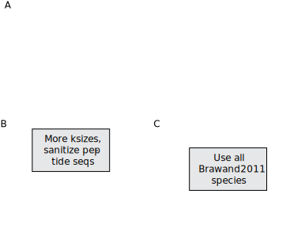

Single-cell RNA-sequencing is a powerful technology for identifying cell types in a variety of species.
However, the task of identifying even known cell types in species with poorly annotated genomes is nontrivial, as orthologous gene mapping remains an unsolved problem [@doi:10.1038/nrg.2016.127; @doi:10.1146/annurev-cellbio-100616-060818] and most of the 8.7 million Eukaryotic species on Earth have no sequenced genome [@doi:10.1371/journal.pbio.1001127].
Thus, there is an unmet need to quantitatively compare single-cell transcriptomes across species, without the need for orthologous gene mapping, gene annotations, or a reference genome.
Short, $k$-long sequence substrings, or $k$-mers, have been proposed for comparing single cells [@url:https://doi.org/10.1101/723833] as they are a fast, simple way to create cell-cell similarities.
Combining $k$-mers from putatitvely translated RNA-seq reads with reduced amino acid alphabets [@doi:10.1093/bioinformatics/btp164 @doi:10.1093/gigascience/giz118 @doi:10.1093/bioinformatics/10.4.453; @10.1186/1471-2105-12-159; @doi:10.1093/protein/13.3.149; @doi:10.1093/bioinformatics/btp164; @doi:10.1093/nar/gkh180] , we developed a method to identify known cell types in a non-model organism using a reference atlas from another organism, without the need for a genome or gene annotation from the non-model organism.
This method relies solely on divergence time between species, which we show can be estimated from RNA-seq nucleotide $k$-mers.
We benchmark the genome-agnostic method on the Quest for Orthologs Opisthokonta dataset, showing that $k$-mers from reduced amino acid alphabets are sufficient to estimate orthology.
Using human amino acid sequences, we show that one can extract putative protein-coding reads from 239 Opisthokonta species in ENSEMBL, and show the best $k$-mer size and alphabet for different divergence times.
We apply this method on a bulk comparative transcriptomic dataset consisting of nine species and six tissues, showing that we can recapitulate the results as using only reads mapping to 1:1 orthologs of protein-coding genes, and we are able to resolve ... which can only be seen by using the reference-free $k$-mer method.

We then show that reduced amino acid protein $k$-mers can be used for comparing single-cell transcriptomes across mouse, human, and zebrafish hematopoiesis.
We find that using $k$-mers has the advantage of resolving ... in comparison to using read counts from 1:1 gene orthologs.
Using $k$-mers, we were able to resolve cell types ... , which was hidden using read counts alone.
Thus, we have show the reference-free methods using the $k$-mers from single cells is a novel, annotation-agnostic method for comparing cells across species that is capable of identifying cell states unique to a particular organism, helping to build the cell type evolution tree of life.

## Figure 1 -- Overview of `kmermaid` pipeline

![**A.** Overview of the `kmermaid` pipeline. (**a**, **b**, **c**) `kmermaid` consists of a protein-coding prediction phase (**a**) that is invoked by the command `khtools extract_coding`, a k-mer sketch computation phase (**b**) invoked by the command `sourmash sketch`, a signature similarity comparison phase (**c**) invoked by the command `sourmash compare`, and an optional database-creation phase (**d**) invoked by the command `sourmash index`. The coding prediction phase has three components: (1) six-frame translation, removal of stop-codon frames, and subsequent $k$-merization of RNA-sequencing reads; (2) a degenerate protein alphabet which allows for protein-coding detection from a wide variety of species; (3) a bloom filter containing known protein-coding sequences from a well annotated organism; and (4) computation of the Jaccard index of translated RNA-seq reading frames. The sketch computation phase involves randomly subsetting the degenerate peptide $k$-mers using a MinHash algorithm. The sketch comparison phase consists of computing the Jaccard intersection of MinHashed degenerate peptide $k$-mers between all pairs of samples.](images/figure1.svg){#fig:fig1 width="100%"}

To determine whether short segments of sequences could detect gene orthologues, we $k$-merized orthologous genes derived from the ENSEMBL version 97 [@doi:10.1093/nar/gkx1098] COMPARA database [@doi:10.1093/database/bav096] (Figure [@fig:fig1]).
We compared human protein sequences to orthologous chimpanzee, mouse, (orangutan, bonobo, gorilla, macaque, opossum, platypus, chicken) protein sequences, as these are species used in [@doi:10.1038/nature10532].
As a background, we randomly chose 10 non-orthologous genes relative to the human gene.
In addition to $k$-merizing the protein-coding sequence, we also re-encoded the protein-coding sequence into a six-letter Dayhoff alphabet [@raw:dayhoff1969atlas], a nine-letter encoding [@doi:10.1093/gigascience/giz118], and a two-letter hydrophobic-polar encodings [@raw:phillips2012physical; @doi:10.1021/bi00327a032], show in Table [@tbl:sequence-encodings].

We found that, consistent with previous knowledge, that 1:1 orthologues had higher $k$-mer similarities as determined by the Jaccard Index. This approach is similar to SwiftOrtho [@doi:10.1093/gigascience/giz118], a k-mer based orthology relationship finder.

Additionally, more recently diverged genes had higher $k$-mer similarity as well.

## Outline

- Kmers can approximate orthologies
  - Jaccard similarity of orthologues is higher than non-orthologues
  - Benchmarking using https://orthology.benchmarkservice.org/cgi-bin/gateway.pl
  - Finding orthologues
    - Gold standard
      - ENSEMBL COMPARA
      - Quest for Orthologs consortium, Altenhoff, A. M., Boeckmann, B., Capella-Gutierrez, S., Dalquen, D. A., DeLuca, T., et al. (2016). Standardized benchmarking in the quest for orthologs. Nature Methods, 13(5), 425–430. http://doi.org/10.1038/nmeth.3830 [@doi:10.1038/nmeth.3830]
    - Orthologous groups/Conserved Domain Database [@url:https://www.ebi.ac.uk/miriam/main/collections/MIR:00000119]

## Figure 2 -- $k$-mers from lossily-encoded putative protein-coding reads faithfully pull out reads from protein-coding genes within amniotes

{#fig:fig2 width="100%"}

- Overview of kmermaid pipeline
  - Comparison of tissue across species
    - Partition reads to coding/noncoding bins
    - MinHash the Dayhoff-encoded coding sequences
    - Jaccard similarity on the MinHashes
- Which reads are found to have coding features but didn’t map to the genome?
- Do these features map to novel genes or gene fusions?
- Kmers can find correct reading from of RNA-seq reads
  - Human peptides → human, chimp, bonobo, orangutan, gorilla, macaque, mouse, opossum, playtpus, chicken RNAseq from Brawand2011 data
- Comparison to other methods: RNASamba [@doi:10.1101/620880]

### Figure 3 -- $k$-mers can pull out only reads from transcription factors and Amniotes can be compared on the MinHashes of their protein-coding sequences

{#fig:fig3 width="100%"}

- Kmers can find only transcription factor reads of TFs from RNA-seq reads
  - Human peptides → human, chimp, bonobo, orangutan, gorilla, macaque, mouse, opossum, playtpus, chicken RNAseq from Brawand2011 data

`kmermaid` implements the concept of lightweight orthology assignment using k-mers to the problem of cross-species RNA-seq analyses and achieves unprecedented speed of analysis. By removing the orthology inference step, `kmermaid` opens up the possibilty of finding shared and divergent tissue and cell types across a broad range of species, paving the way for evolutionary analyses of cell types across species. `kmermaid` can be used in *de novo* setting for non-model organisms, finding similar cell types within an organism, or finding similar cell types relative to a reference organism, without the need for a reference genome or transcriptome. The memory usage of `kmermaid` is quite low, using only 50MB for extracting coding sequences and 50MB for assigning protein k-mer signatures. As the number of RNA-seq datasets, especially single-cell RNA-seq datasets continues to grow, we expect `kmermaid` to be widely used for identifying cell types in non-model organisms.

`kmermaid` is free and open-source software and is available as Supplementary Data and at http://github.com/czbiohub/kmermaid and as a scalable Nextflow workflow at http://github.com/nf-core/nf-kmermaid.

### Some potential references

Gene expression evolution through duplications

- Farre, D., & Alba, M. M. (2010). Heterogeneous Patterns of Gene-Expression Diversification in Mammalian Gene Duplicates. Molecular Biology and Evolution, 27(2), 325–335. http://doi.org/10.1093/molbev/msp242 [@doi:10.1093/molbev/msp242]
- Thornton, J. W., & DeSalle, R. (2000). Gene family evolution and homology: genomics meets phylogenetics. Annual Review of Genomics and Human Genetics, 1(1), 41–73. http://doi.org/10.1146/annurev.genom.1.1.41 [@doi:10.1146/annurev.genom.1.1.41]
- Farre, D., & Alba, M. M. (2010). Heterogeneous Patterns of Gene-Expression Diversification in Mammalian Gene Duplicates. Molecular Biology and Evolution, 27(2), 325–335. http://doi.org/10.1093/molbev/msp242 [@doi:10.1093/molbev/msp242]

Taxa-restricted genes

- Human-specific genes in fetal neocortex
Florio, M., Heide, M., Pinson, A., Brandl, H., Albert, M., Winkler, S., et al. (2018). Evolution and cell-type specificity of human-specific genes preferentially expressed in progenitors of fetal neocortex. eLife, 7, D635. http://doi.org/10.7554/eLife.32332 [@doi:10.7554/eLife.32332]
- Insects -- Santos, M. E., Le Bouquin, A., Crumière, A. J. J., & Khila, A. (2017). Taxon-restricted genes at the origin of a novel trait allowing access to a new environment. Science, 358(6361), 386–390. http://doi.org/10.1126/science.aan2748 [@doi:10.1126/science.aan2748]

Correlated evolution of celltypes?

- Liang, C., Musser, J. M., Cloutier, A., Prum, R. O., & Wagner, G. P. (2018). Pervasive Correlated Evolution in Gene Expression Shapes Cell and Tissue Type Transcriptomes. Genome Biology and Evolution, 10(2), 538–552. http://doi.org/10.1093/gbe/evy016 [@doi:10.1093/gbe/evy016]

Cell type homology

- Thornton, J. W., & DeSalle, R. (2000). Gene family evolution and homology: genomics meets phylogenetics. Annual Review of Genomics and Human Genetics, 1(1), 41–73. http://doi.org/10.1146/annurev.genom.1.1.41 [@doi:10.1146/annurev.genom.1.1.41]
- Tschopp, P., & Tabin, C. J. (2017). Deep homology in the age of next-generation sequencing. Philosophical Transactions of the Royal Society B: Biological Sciences, 372(1713), 20150475–8. http://doi.org/10.1098/rstb.2015.0475 [@doi:10.1098/rstb.2015.0475]
- Hejnol, A., & Lowe, C. J. (2015). Embracing the comparative approach: how robust phylogenies and broader developmental sampling impacts the understanding of nervous system evolution. Philosophical Transactions of the Royal Society B: Biological Sciences, 370(1684), 20150045–16. http://doi.org/10.1098/rstb.2015.0045 [@doi:10.1098/rstb.2015.0045]
- Santos, M. E., Le Bouquin, A., Crumière, A. J. J., & Khila, A. (2017). Taxon-restricted genes at the origin of a novel trait allowing access to a new environment. Science, 358(6361), 386–390. http://doi.org/10.1126/science.aan2748 [@doi:10.1126/science.aan2748]
- Mammalian decidual cell

Cell type evolution

- Erkenbrack, E. M., Maziarz, J. D., Griffith, O. W., Liang, C., Chavan, A. R., Nnamani, M. C., & Wagner, G. P. (2018). The mammalian decidual cell evolved from a cellular stress response. PLOS Biology, 16(8), e2005594–27. http://doi.org/10.1371/journal.pbio.2005594 [@doi:10.1371/journal.pbio.2005594]
