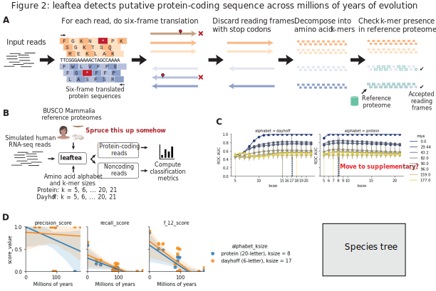

## Introduction

Single-cell RNA-sequencing is a powerful technology for identifying cell types in a variety of species.
However, the task of identifying even known cell types in species with poorly annotated genomes is nontrivial, as 99.999% of the predicted 8.7 million Eukaryotic species on Earth have no submitted genome assembly [@doi:10.1371/journal.pbio.1001127; @url:https://www.ncbi.nlm.nih.gov/genome/browse#!/overview/] and identifying orthologous genes, which remains an open problem [@doi:10.1038/nrg.2016.127; @doi:10.1146/annurev-cellbio-100616-060818].
Thus, there is an unmet need to quantitatively compare single-cell transcriptomes across species, without the need for orthologous gene mapping, gene annotations, or a reference genome.
Short, $k$-long sequence substrings, or $k$-mers, have been proposed for clustering single cells [@url:https://doi.org/10.1101/723833] and here we implemented $k$-mers from putatitvely translated RNA-seq reads with reduced amino acid alphabets [@doi:10.1093/bioinformatics/btp164 @doi:10.1093/gigascience/giz118 @doi:10.1093/bioinformatics/10.4.453; @10.1186/1471-2105-12-159; @doi:10.1093/protein/13.3.149; @doi:10.1093/bioinformatics/btp164; @doi:10.1093/nar/gkh180], to find shared cell types across species, and further identify *de novo* orthologous genes by querying the predicted protein sequences to a reference database.
This method relies solely on divergence time between species, which we show can be estimated from RNA-seq nucleotide $k$-mers (Supplemental Figure [@sfig:sfig1]).

We benchmark the genome-agnostic method on the Quest for Orthologs Opisthokonta dataset, showing that $k$-mers from reduced amino acid alphabets are sufficient to estimate orthology.
Using human amino acid sequences, we show that one can extract putative protein-coding reads from 35 Opisthokonta species in Quest for Orthologs, and present the best $k$-mer size and alphabet for different divergence times.

We first apply this method on a bulk comparative transcriptomic dataset consisting of nine amniote species and six tissues [@doi:10.1038/nature10532], showing that we achieve similar clustering results as using only reads mapping to 1:1 orthologs or Hierarchical Orthologous Groups (HOGs) [@doi:10.1371/journal.pone.0053786; @doi:10.1093/bib/bbr034; @doi:10.1093/bioinformatics/btu492] of protein-coding genes, but are able to resolve ... which can only be seen by using the $k$-mer method.
We further demonstrate the utility of this method by comparing transcriptomes from organisms diverged by approximately 676 million years [@url:http://timetree.org/]:  a single-cell atlas of a model organism, mouse from *Tabula Muris Senis* [@url:https://www.biorxiv.org/content/10.1101/661728v2], and bulk RNA-seq from *Botryllus schlosseri* [@doi:10.1038/s41586-018-0783-x], a colonial tunicate which exhibits cell populations similar to the myeloid immune lineage.
Across this evolutionary distance, only XX 1:1 orthologous genes exist as found by ... and XX HOGs via orthologous matrix (OMA) [@doi:10.7717/peerj.6231; @doi:10.1093/bioinformatics/btx229]
We show that the myeloid-like cells from *B. schlosseri* not only cluster with the myeloid immune cells from *Tabula Muris Senis*, we also find *de novo* orthologous genes, such as ...
We find that using $k$-mers has the advantage of resolving ... in comparison to using read counts from 1:1 gene orthologs.
Using $k$-mers, we were able to resolve cell types ... , which was hidden using read counts alone.
Thus, we have shown the reference-free method using the $k$-mers from single cells is a novel, annotation-agnostic method for comparing cells across species that is capable of identifying cell states unique to a particular organism, helping to build the cell type evolutionary tree of life.

## Results

![
Figure 1.
**A.** Overview of `nf-core/kmermaid` pipeline to compare DNA/RNA/protein sequences on k-mer content.
1. If input is bam, extract per-cell sequences using `bam2fasta percell`.
2. Predict amino acid sequence of each RNA-seq read using `sencha translate`.
3. Randomly subsample amino acid k-mers via MinHash using `sourmash sketch`.
4. Compare all k-mer sketches to one another using `sourmash compare` to compute cell-cell Jaccard similarities.
5. Build sequence bloom tree using `sourmash index`.
6. Build k-nearest neighbor graph using sequence bloom tree.
7. Build UMAP off of KNN.
**B.** Overview of `czbiohub/nf-predictorthologs` pipeline to query putative function of protein sequences.
1. If input is bam, must also have a convert bam reads to raw fastq files using the `samtools fastq` subcommand (samtools version 1.9). If input is fastqs, go directly to second step.
2. Trim adapters, poly-A, polyG using the `fastp` tool.
3. Predict protein-coding sequence using khtools extract_coding, using conservative UniProt/SwissProt manually curated database as examples of known protein-coding sequences, for most stringent definition of protein-coding.
4. Query predicted protein in permissive NCBI RefSeq non-redundant protein database for most complete search query.
](images/SVG/figure1.svg){#fig:fig1 width="100%"}

To determine whether short segments of sequences could detect gene orthologues, we $k$-merized orthologous genes derived from the ENSEMBL version 97 [@doi:10.1093/nar/gkx1098] COMPARA database [@doi:10.1093/database/bav096] (Figure [@fig:fig1]).
We compared human protein sequences to orthologous chimpanzee, mouse, (orangutan, bonobo, gorilla, macaque, opossum, platypus, chicken) protein sequences, as these are species used in [@doi:10.1038/nature10532].
In addition to $k$-merizing the protein-coding sequence, we also re-encoded the protein-coding sequence into a six-letter Dayhoff alphabet [@raw:dayhoff1969atlas], a nine-letter encoding [@doi:10.1093/gigascience/giz118], and a two-letter hydrophobic-polar encodings [@raw:phillips2012physical; @doi:10.1021/bi00327a032], show in Table [@tbl:sequence-encodings].

<!-- We found that, consistent with previous knowledge, that 1:1 orthologues had higher $k$-mer similarities as determined by the Jaccard Index. This approach is similar to SwiftOrtho [@doi:10.1093/gigascience/giz118], a k-mer based orthology relationship finder.

Additionally, more recently diverged genes had higher $k$-mer similarity as well.

Across tissues of the same time from the Brawand 2011 [@doi:10.1038/nature10532] dataset, we extracted protein-coding sequences, generated dayhoff signatures of k-mer size length 12, extracted hashes and thus k-mers shared by samples from the same tissue, went back to the original protein sequence, and searched NCBI RefSeq NR for potential proteins.
For each sample, we observed that shared k-mers appeared in 1:1 orthologous genes XX% of the time 1:many orthologs YY% of the time, many:many orthologs ZZ% of the time, in genes not known to be orthologs AA% of the time, in unannotated regions AA% of the time, in multimapped reads BB% of the time, and in unmapped reads CC% of the time.
Overall, we observed XX de novo orthologs in each tissue.
We removed genes that were already known to be orthologous. -->

{#fig:fig2 width="100%"}

To identify novel orthologs among annotated species related by ~300 million years, we first applied these methods on a seminal comparative transcriptomics dataset of human,  chimpanzee, mouse, orangutan, bonobo, gorilla, macaque, opossum, platypus, and chicken [@doi:10.1038/nature10532]. We found ..

To identify common cell types from a known cell atlas to a less well-annotated species related by ~700 million years, we applied these methods to a mouse single-cell RNA-seq atlas, *Tabula Muris Senis* [@url:https://www.biorxiv.org/content/10.1101/661728v2], and bulk RNA-seq from *Botryllus schlosseri* [@doi:10.1038/s41586-018-0783-x]. We found that the signal for myeloid cell types is strongly conserved when using a protein k-mer size of XX and a XX amino acid encoding. We also find ..

To identify common developmental trajectories across >1000 million years of divergence, we merged transcriptomes from *Hydra* [@doi:10.1126/science.aav9314], zebrafish [@doi:10.1126/science.aar4362], and mouse [@doi:10.1038/s41586-019-0969-x]. We demonstrate that the transcriptional signal from ectoderm, mesoderm, and endoderm are conserved when using a protein k-mer size of XX and an XX amino acid encoding.

## Discussion

`kmermaid` implements the concept of lightweight orthology assignment using k-mers to the problem of cross-species RNA-seq analyses and achieves unprecedented speed of analysis. By removing the orthology inference step, `kmermaid` opens up the possibilty of finding shared and divergent tissue and cell types across a broad range of species, paving the way for evolutionary analyses of cell types across species. `kmermaid` can be used in *de novo* setting for non-model organisms, finding similar cell types within an organism, or finding similar cell types relative to a reference organism, without the need for a reference genome or transcriptome. The memory usage of `kmermaid` is quite low, using only 50MB for extracting coding sequences and 50MB for assigning protein k-mer signatures. As the number of RNA-seq datasets, especially single-cell RNA-seq datasets continues to grow, we expect `kmermaid` to be widely used for identifying cell types in non-model organisms.

In summary, we developed a method to identify both known cell types in a non-model organism using a reference atlas from another organism, without the need for a genome or gene annotation from the non-model organism.
This method can be used to combine single-cell cell atlases from well-annotated,  model organisms, with sequencing data from poorly annotated non-model organisms, to directly find homologous cell types and orthologous genes.
By eliminating read alignment and orthologous gene mapping, `kmermaid` enables comparison of transcriptomes of the remaining 99.999% Eukaryotic species on Earth without submitted genome assemblies, with the cell atlases of a handful of model organisms to identify shared and novel cell types, and *de novo* identify orthologous genes.
By identifying homologous cell types across a broad variety of species, we come closer to an understanding of the evolution of genes, cells, and thus life itself.

`kmermaid` is free and open-source software and is available as Supplementary Data and at http://github.com/czbiohub/kmermaid and as a scalable Nextflow workflow at http://github.com/nf-core/nf-kmermaid.

## Outline

- Kmers can approximate orthologies
  - Jaccard similarity of orthologues is higher than non-orthologues
  - Benchmarking using https://orthology.benchmarkservice.org/cgi-bin/gateway.pl
  - Finding orthologues
    - Gold standard
      - ENSEMBL COMPARA
      - Quest for Orthologs consortium, Altenhoff, A. M., Boeckmann, B., Capella-Gutierrez, S., Dalquen, D. A., DeLuca, T., et al. (2016). Standardized benchmarking in the quest for orthologs. Nature Methods, 13(5), 425–430. http://doi.org/10.1038/nmeth.3830 [@doi:10.1038/nmeth.3830]
    - Orthologous groups/Conserved Domain Database [@url:https://www.ebi.ac.uk/miriam/main/collections/MIR:00000119]

<!-- ## Figure 2 -- $k$-mers from lossily-encoded putative protein-coding reads faithfully pull out reads from protein-coding genes within amniotes -->

- Overview of kmermaid pipeline
  - Comparison of tissue across species
    - Partition reads to coding/noncoding bins
    - MinHash the Dayhoff-encoded coding sequences
    - Jaccard similarity on the MinHashes
- Which reads are found to have coding features but didn’t map to the genome?
- Do these features map to novel genes or gene fusions?
- Kmers can find correct reading from of RNA-seq reads
  - Human peptides → human, chimp, bonobo, orangutan, gorilla, macaque, mouse, opossum, playtpus, chicken RNAseq from Brawand2011 data
- Comparison to other methods: RNASamba [@doi:10.1101/620880]

<!-- ### Figure 3 -- $k$-mers can pull out only reads from transcription factors and Amniotes can be compared on the MinHashes of their protein-coding sequences -->

<!-- {#fig:fig3 width="100%"} -->

- Kmers can find only transcription factor reads of TFs from RNA-seq reads
  - Human peptides → human, chimp, bonobo, orangutan, gorilla, macaque, mouse, opossum, playtpus, chicken RNAseq from Brawand2011 data

### Some potential references

Gene expression evolution through duplications

- Farre, D., & Alba, M. M. (2010). Heterogeneous Patterns of Gene-Expression Diversification in Mammalian Gene Duplicates. Molecular Biology and Evolution, 27(2), 325–335. http://doi.org/10.1093/molbev/msp242 [@doi:10.1093/molbev/msp242]
- Thornton, J. W., & DeSalle, R. (2000). Gene family evolution and homology: genomics meets phylogenetics. Annual Review of Genomics and Human Genetics, 1(1), 41–73. http://doi.org/10.1146/annurev.genom.1.1.41 [@doi:10.1146/annurev.genom.1.1.41]
- Farre, D., & Alba, M. M. (2010). Heterogeneous Patterns of Gene-Expression Diversification in Mammalian Gene Duplicates. Molecular Biology and Evolution, 27(2), 325–335. http://doi.org/10.1093/molbev/msp242 [@doi:10.1093/molbev/msp242]

Taxa-restricted genes

- Human-specific genes in fetal neocortex
Florio, M., Heide, M., Pinson, A., Brandl, H., Albert, M., Winkler, S., et al. (2018). Evolution and cell-type specificity of human-specific genes preferentially expressed in progenitors of fetal neocortex. eLife, 7, D635. http://doi.org/10.7554/eLife.32332 [@doi:10.7554/eLife.32332]
- Insects -- Santos, M. E., Le Bouquin, A., Crumière, A. J. J., & Khila, A. (2017). Taxon-restricted genes at the origin of a novel trait allowing access to a new environment. Science, 358(6361), 386–390. http://doi.org/10.1126/science.aan2748 [@doi:10.1126/science.aan2748]

Correlated evolution of celltypes?

- Liang, C., Musser, J. M., Cloutier, A., Prum, R. O., & Wagner, G. P. (2018). Pervasive Correlated Evolution in Gene Expression Shapes Cell and Tissue Type Transcriptomes. Genome Biology and Evolution, 10(2), 538–552. http://doi.org/10.1093/gbe/evy016 [@doi:10.1093/gbe/evy016]

Cell type homology

- Thornton, J. W., & DeSalle, R. (2000). Gene family evolution and homology: genomics meets phylogenetics. Annual Review of Genomics and Human Genetics, 1(1), 41–73. http://doi.org/10.1146/annurev.genom.1.1.41 [@doi:10.1146/annurev.genom.1.1.41]
- Tschopp, P., & Tabin, C. J. (2017). Deep homology in the age of next-generation sequencing. Philosophical Transactions of the Royal Society B: Biological Sciences, 372(1713), 20150475–8. http://doi.org/10.1098/rstb.2015.0475 [@doi:10.1098/rstb.2015.0475]
- Hejnol, A., & Lowe, C. J. (2015). Embracing the comparative approach: how robust phylogenies and broader developmental sampling impacts the understanding of nervous system evolution. Philosophical Transactions of the Royal Society B: Biological Sciences, 370(1684), 20150045–16. http://doi.org/10.1098/rstb.2015.0045 [@doi:10.1098/rstb.2015.0045]
- Santos, M. E., Le Bouquin, A., Crumière, A. J. J., & Khila, A. (2017). Taxon-restricted genes at the origin of a novel trait allowing access to a new environment. Science, 358(6361), 386–390. http://doi.org/10.1126/science.aan2748 [@doi:10.1126/science.aan2748]
- Mammalian decidual cell

Cell type evolution

- Erkenbrack, E. M., Maziarz, J. D., Griffith, O. W., Liang, C., Chavan, A. R., Nnamani, M. C., & Wagner, G. P. (2018). The mammalian decidual cell evolved from a cellular stress response. PLOS Biology, 16(8), e2005594–27. http://doi.org/10.1371/journal.pbio.2005594 [@doi:10.1371/journal.pbio.2005594]

<!-- # Discussion -->
