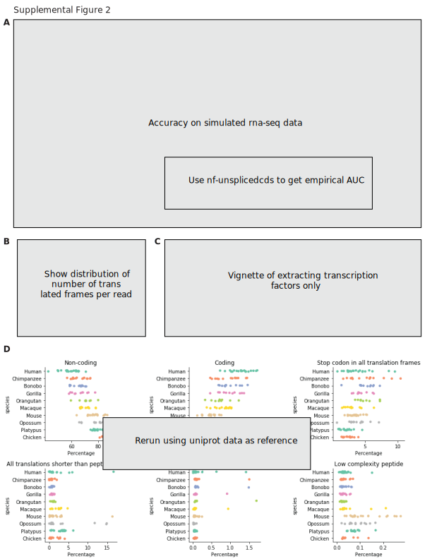

### Benchmarking

Methods go here.


### Computational

{#sfig:sfig2 tag="sfig2" width="100%"}

#### $k$-mer comparison of orthologous genes

We used ENSEMBL version 97.
We did things.
One sentence per line.
Prefer DOI for references, but for Biorxiv use the URL.
DOI example: [@doi:10.1038/nmeth.3830].
Biorxiv example: [@url:https://doi.org/10.1101/466201].
Multiple citations per line example: [@doi:10.1038/nmeth.3830; @url:https://doi.org/10.1101/466201].

#### Extraction of putative coding reads from RNA-seq

We did things.
One sentence per line.
Prefer DOI for references, but for Biorxiv use the URL.
DOI example: [@doi:10.1038/nmeth.3830].
Biorxiv example: [@url:https://doi.org/10.1101/466201].
Multiple citations per line example: [@doi:10.1038/nmeth.3830; @url:https://doi.org/10.1101/466201].


## Supplemental Methods

|  Amino acid                    | Property              | Dayhoff | Hydrophobic-polar (HP) |
| :----------------------------- | :-------------------- | :------ | :--------------------- |
| C                              | Sulfur polymerization | a       | p                      |
| A, G, P, S, T                  | Small                 | b       | A, G, P: h             |
|                                |                       |         | S,T: p                 |
| D, E, N, Q                     | Acid and amide        | c       | p                      |
| H, K, R                        | Basic                 | d       | p                      |
| I, L, M, V                     | Hydrophobic           | e       | h                      |
| F, W, Y                        | Aromatic              | f       | h                      |

Table: Dayhoff and hydrophobic-polar encodings are a reduced amino acid
alphabet allowing for permissive cross-species sequence comparisons. For
example, the amino acid sequence `SASHAFIERCE` would be Dayhoff-encoded
to `bbbdbfecdac`, and HP-encoded to `phpphhhpppp`. {#tbl:sequence-encodings}


## Applications

### Installation

`sencha` can be installed with the Anaconda package manager, `conda` (preferred),

```
# Note: not actually on bioconda yet ... this is aspirational
conda install --channel bioconda sencha
```

or from the Python Package Index (PyPI) with the Python package manager, `pip`,

```
# Note: not actually on PyPI yet ... this is aspirational
pip install sencha
```

### Prediction of protein-coding sequences across a variety of species

We used `sencha translate` to obtain putative protein-coding sequences from a comaparative transcriptomic dataset spanning nine species and six tissues [@doi:10.1038/nature10532].

### Read preprocessing

As the protein-coding score is assessed on the entire read, we recommend RNA-seq reads be removed of library artifacts to the best of the user's ability.
This means, the adapters should be trimmed, and if there was a negative insert size such that the R1 and R2 reads overlap, then the read pairs should be merged.


#### Creation of amino acid $k$-mer database with `sencha index`

Before predicting protein-coding sequences, `sencha` must create a database of known amino acid $k$-mers, which is stored in the form of a probabilistic set membership data structure known as a bloom filter.
`sencha` uses the bloom filter implementation in `khmer`/`oxli` [@doi:10.12688/f1000research.6924.1; @doi:10.1371/journal.pone.0101271], called a NodeGraph.
We created a dataset of known amino acid $k$-mers from the manually annotated UniProtKB/Swiss-Prot databases [@doi:10.1093/nar/gky1049; @doi:10.1007/978-1-4939-3167-5_2].
We used only protein sequences observed in *Opisthokont* species [@url:https://en.wikipedia.org/wiki/Opisthokont], previously known as a "Fungi/Metazoa" group that encompasseses "Fungus-like" *Holomycota* and "Animal-like" *Holozoa*. [NOTE: Does this need a figure/phylogenetic timetree?]

```
sencha index \
  --tablesize 100000000 \
  --molecule protein \
  --peptide-ksize 7 \
  --save-as uniprot-reviewed_yes+taxonomy_2759__molecule-protein_ksize-7.bloomfilter \
  uniprot-reviewed_yes+taxonomy_2759.fasta.gz
```

#### Prediction of protein-coding sequences with `sencha translate`

We then predicted protein coding reads using the created bloom filter using `sencha translate`.

```
sencha translate \
  --molecule protein \
  --coding-nucleotide-fasta SRR306800_GSM752653_ggo_br_F_1__coding_reads_nucleotides.fasta \
  --csv SRR306800_GSM752653_ggo_br_F_1__coding_scores.csv \
  --json-summary SRR306800_GSM752653_ggo_br_F_1__coding_summary.json \
  --jaccard-threshold 0.8 \
  --peptides-are-index \
  uniprot-reviewed_yes+taxonomy_2759__molecule-protein_ksize-7.bloomfilter \
  SRR306800_GSM752653_ggo_br_F_1_trimmed.fq.gz > SRR306800_GSM752653_ggo_br_F_1__coding_reads_peptides.fasta
```

![Applications of `sencha translate`. **A.** We simulated RNA-seq data using Opisthokonta species from the Quest for Orthologs dataset for true positive protein-coding RNAs, reads completely contained within intergenic, intronic, and UTR sequences as true positive noncoding RNAs, and reads partially overlapping a coding and noncoding region as an adversarial test set. We then predicted protein-coding sequences and computed false positive and false negative rates. False Positive coding reads were found to be ... False negative noncoding reads were found to be ... **B.** Number of putative protein-coding sequences per read. **C.** This method could also be used to extract only reads whose putative protein-coding sequences are transcription factors. **D.** We ran `sencha translate` on the five tissues and nine species from the Brawand 2011 dataset.](images/SVG/supplemental_figure2.svg){#sfig2:sfig2 tag="supplemental_figure2" width="100%"}


<!-- ### `sencha compare-kmer-content` is a simple method to identify homologs

![Applications of `sencha compare-kmer-content`. **A.** We used `sencha compare-kmer-content` on pairs of orthologous protein sequences between humans and the remaining Opisthokonta species in the Quest for Orthologs dataset. x-axis, $k$-mer size, y-axis, mean difference. **B.** False positive calls by `sencha compare-kmer-content` are either paralogs or read-through protein products. **C.** We applied `sencha compare-kmer-content` to ... to find putative orthologs. We found ... the accuracy was ...](images/SVG/figure4.svg){#sfig:figure4 tag="figure4" width="100%"} -->
