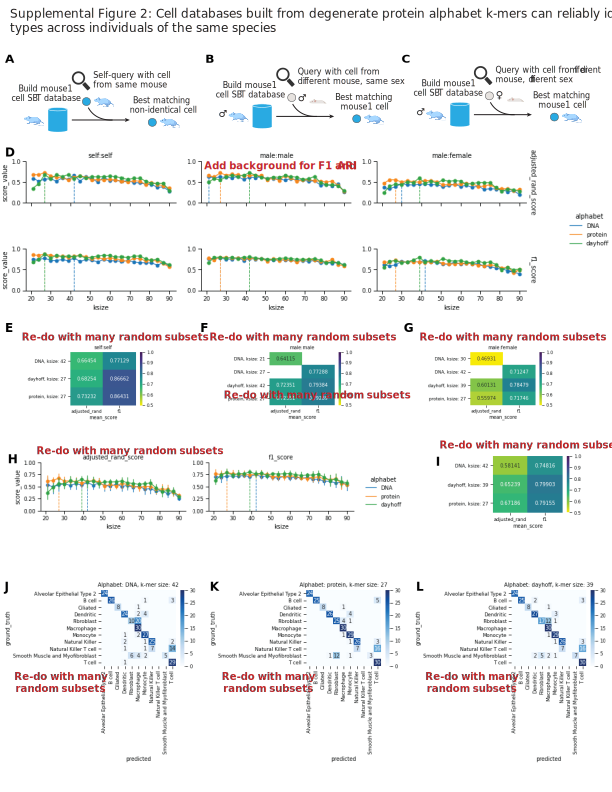

### Benchmarking

Methods go here.

#### Computational

{#sfig:sfig2 tag="sfig2" width="100%"}

##### $k$-mer comparison of orthologous genes

We used ENSEMBL version 97.
We did things.
One sentence per line.
Prefer DOI for references, but for Biorxiv use the URL.
DOI example: [@doi:10.1038/nmeth.3830].
Biorxiv example: [@url:https://doi.org/10.1101/466201].
Multiple citations per line example: [@doi:10.1038/nmeth.3830; @url:https://doi.org/10.1101/466201].

##### Extraction of putative coding reads from RNA-seq

We did things.
One sentence per line.
Prefer DOI for references, but for Biorxiv use the URL.
DOI example: [@doi:10.1038/nmeth.3830].
Biorxiv example: [@url:https://doi.org/10.1101/466201].
Multiple citations per line example: [@doi:10.1038/nmeth.3830; @url:https://doi.org/10.1101/466201].

#### Prediction of protein-coding sequences across a variety of species

We used `sencha translate` to obtain putative protein-coding sequences from a comaparative transcriptomic dataset spanning nine species and six tissues [@doi:10.1038/nature10532].

#### Read preprocessing

As the protein-coding score is assessed on the entire read, we recommend RNA-seq reads be removed of library artifacts to the best of the user's ability.
This means, the adapters should be trimmed, and if there was a negative insert size such that the R1 and R2 reads overlap, then the read pairs should be merged.
